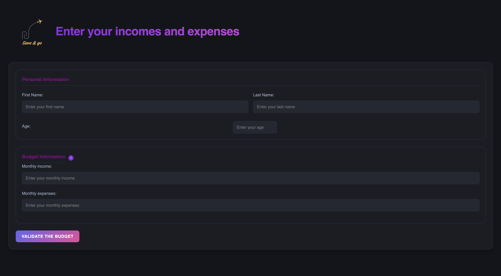
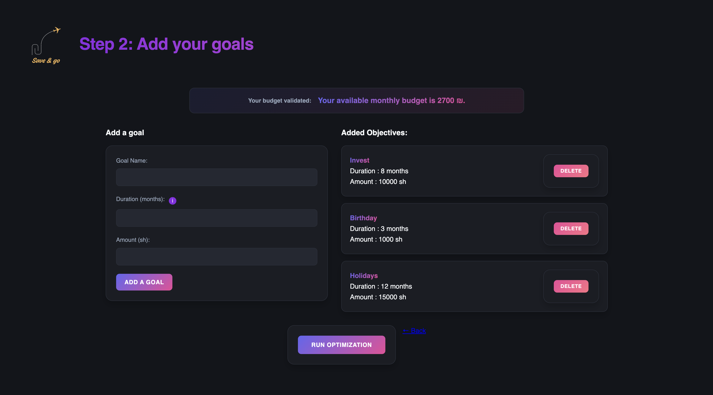

# Save & Go – Smart Financial Assistant for Students 💰

Save & Go is a smart financial planning system built to help students in Israel better manage their income, expenses, and savings goals.

## Project Overview

Only **32%** of students save money, and **22%** take loans—often over ₪20,000.  
**Save & Go** solves this with a personalized assistant that helps students:

- Track their income and expenses.
- Define savings goals.
- Receive optimized monthly saving suggestions.
- Get recommendations when goals are unreachable.

Our mission: **Make financial wellness accessible to every student.**

---

## Technologies

- **Frontend:** HTML, CSS  
- **Backend:** Python (Flask)  
- **Database:** PostgreSQL  
- **Methodology:** Agile

---

## How It Works

1. User inputs monthly income and expenses.
2. Defines financial goals (e.g., save ₪10,000 in 10 months).
3. The system calculates the **optimal monthly saving plan**.
4. It proposes solutions if goals are currently unreachable.

---

## Team Members

- **Nathan Douieb** – Lead Developer  
- **Julie Alali** – UI/UX Design  
- **Yaakov Sassen** – System Analysis & QA  
- **Matan Moshe** – Project Management & Marketing  

---

## What's Next?

- Mobile App (Android & iOS)
- Integration with bank accounts
- AI-powered smart recommendations
- National deployment for all students

---

> 🧠 *Save & Go – because every shekel counts.*
